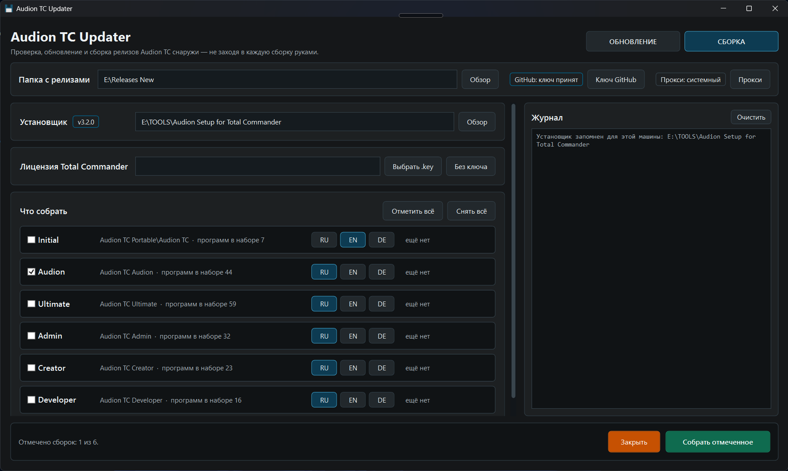

# Audion TC Updater

<!-- audion:release -->

  
  
  
  

**Version 1.2.0** · 2026-09-20 · 611 KB

- [Direct download](https://dl.audion.dev/tc-updater/1.2.0/Audion_TC_Updater_v1.2.0_Full.zip) — unmetered, no rate limits
- [Project page](https://audion.dev/downloads/tc-updater) — every version and how to install
- [GitHub release](https://github.com/Tensionix/tc-updater/releases/tag/v1.2.0)

`SHA-256: 4ebfc39f5a5fcf06dcfe3b62dc3124f0a836537dd461cb443c1f17f06eb9457d`

---

An **Audion** tool, published by [Tensionix](https://github.com/Tensionix).
<!-- /audion:release -->

[Русский](docs/README_RU.md)

**Contents**

- [The window](#the-window)
- [Three files without the window](#three-files-without-the-window)
- [Which builds are taken](#which-builds-are-taken)
- [UPDATE](#update)
- [BUILD](#build)
  - [Licence](#licence)
- [GitHub key](#github-key)
- [Fingerprints instead of versions](#fingerprints-instead-of-versions)
- [The proxy](#the-proxy)
- [Settings](#settings)

Checks, updates and rebuilds Audion TC release builds from scratch - from the outside,
without going into each one by hand.

## The window

`Start.exe` opens the window. At the top are the releases folder and the section
switch **UPDATE | BUILD**; the log runs down the right side at full height - on a
16:9 screen height is what runs out first.

On the first start the window asks what to work with on this machine: the releases
folder, the installer and the GitHub key. Only the releases folder is required: without
the installer the BUILD section waits, without the key GitHub allows 60 requests an hour.
An installer lying inside the chosen releases folder is filled in by itself.

While a check, an update or a build is going on, a bar runs at the bottom and a line says
what is happening, for how long and at which step - "Checking · 0:04 · Asking the sources…".
It is refreshed four times a second together with the log, so it is plain that the program
is alive rather than stuck.

The window starts with a check, and a check changes nothing. For another releases
folder use Browse or type the path into the field: it is taken on Enter or when you
leave the field, and the next start opens on it.

## Three files without the window

| File | What it does | What it changes |
| --- | --- | --- |
| `Check-Releases.cmd` | shows what is out of date in the builds | nothing - not a byte is written into the builds |
| `Update-Releases.cmd` | shows a plan, asks, then updates | programs inside the builds, their buttons, menus and atlas |
| `Build-Releases.cmd` | shows a plan, asks, then builds every variant on the list from scratch | a build takes the place of the previous one only when it installed completely |

Run them with a double click; they take the folders chosen at the first start. To work
with another releases folder, drop it on the file. Until the first start has happened,
the files ask to open `Start.exe` or to drop a folder.

## Which builds are taken

Any `Audion TC…` folder in the releases folder: Initial, Audion, Ultimate, Creator,
Dev, Admin - as many as there are. A container such as
`Audion TC Portable\Audion TC` is found too. A build is a folder holding
`TOTALCMD64.EXE`.

## UPDATE

The check shows a table: programs in rows, builds in columns. A cell holds the
version in the build, the author's version and an "update" tick. A click on a
program ticks its whole row, a click on a build - its whole column.

Below the table:

- **current** - which programs are up to date, per build;
- **source version unknown** - the author's site does not name the version until the
  file is downloaded (FastStone, HWiNFO, Sysinternals and a few more).

Total Commander appears in the table when ghisler.com has a newer one.

The **"template"** mark means the file comes from the installer and is not downloaded
during an install. Updating the release refreshes it, but the next build from scratch
brings the old one back - update the installer as well. fzf is no longer marked: since
14.09.2026 an install fetches it fresh by itself.

The report is saved to `._runtime\reports\` as a table. At the end the check makes sure
that not a single file in the builds has changed, and says so.

Total Commander plugins are not checked: their archives are published without a
version number in the name.

"Update selected" asks first. Then, for every build:

1. if anything is running from it right now, the build is skipped;
2. the ticked programs are updated, and Total Commander itself when needed;
3. previous versions (`.bak`) are removed;
4. buttons, menus, the atlas and the program picker are rebuilt;
5. machine state is tidied away: the check cache, temporary downloads, the icon cache;
6. the result is verified.

The update runs the build's own scripts - the same ones its console uses.

## BUILD

A build from scratch follows the same plan as an install through the wizard: the plan
file `Setup\Scripts\Invoke-AudionInstall.ps1` is taken from the
`Audion Setup for Total Commander` installer. So a release cannot drift away from what a
person gets by installing Audion TC themselves.

The installer is a field of its own with a Browse button, its version a badge by the
title. The first start asks for it, and it can be switched here - to the installer
master or to its package alike; the releases folder stays as it is.

The section has a row for every variant: a tick, the folder, how many programs its
set holds, the menu language and when the current build was made. The menu language
can be switched before building.

Ticked variants are built **one at a time**, so polling the sources stays within the
GitHub limit. For each:

1. Total Commander is fetched from ghisler.com into a draft,
   `_stage\<set>-<time>\Audion TC` in the releases folder;
2. the set's programs and every plugin that has a source are installed; each plugin is
   registered in `Wincmd.ini`;
3. the atlas and the program picker are rebuilt in the menu language;
4. machine state is cleared from the draft: temporary downloads, caches, the token file;
5. everything installed - the previous build goes, the new one takes its place;
6. something did not install - the previous release stays as it was, the draft stays in
   `_stage`, and the log and the report show what is missing.

The container around a build - `README.md`, `licenses` and the rest of
`Audion TC Portable` - is left alone. Initial takes a few minutes, Ultimate half an hour
or more. The report goes to `._runtime\reports\build-*.md`.

| Build | Set | Folder | Menu |
| --- | --- | --- | --- |
| Initial | `initial` | `Audion TC Portable\Audion TC` | EN |
| Audion | `audion` | `Audion TC Audion` | RU |
| Ultimate | `ultimate` | `Audion TC Ultimate` | RU |
| Admin | `admin` | `Audion TC Admin` | RU |
| Creator | `creator` | `Audion TC Creator` | RU |
| Dev | `programmer` | `Audion TC Dev` | RU |

Admin, Creator and Dev are sets by occupation: they are built exactly by their list,
the way the wizard installs them.

### Licence

Above the build list is a field for `WINCMD.KEY`. The chosen key goes into every
selected build, next to `TOTALCMD64.EXE`. The key is not remembered: the next time
the window opens the field is empty again. The question before building and the
report name the key file, and a build row whose release already holds a key is
marked "with key".

A build with a key is personal: never publish it.

Without the window, drop `WINCMD.KEY` on `Build-Releases.cmd` - together with a
releases folder if you like.

## GitHub key

Without a key GitHub allows 60 requests an hour, and the builds carry fifty
programs. The key is kept in plain text in `config\api_key_github.txt` - one line, and
nothing else in the file.

The first start asks for the key together with the folders. After that it stands in the
window beside the releases folder: the badge shows whether GitHub accepted it, and the
"GitHub key" button opens a dialog - paste a new key, check the saved one or remove it.
A new key is saved only when GitHub accepts it, or unchecked when GitHub does not answer.
Without the window, change the key in the file itself.

At the start of a check, an update and a build the log says whether GitHub accepted
the key and how many requests an hour are left. A key GitHub refuses is not passed on,
and polling goes without it. An accepted key reaches the processes through the
environment and never lands in the builds. The key file is excluded from git.

## Fingerprints instead of versions

For about ten programs the version cannot be read off the site - they used to sit forever in
"source version unknown without downloading". The loader of the build now takes a fingerprint for
them - the file name off the link, the tag of a nightly build, or the ETag from a `HEAD` request -
and keeps it in `Ware\State\app-fingerprints.json`. The check compares the fingerprint at the source
with the one the build took while downloading: different - the program is up for an update, same -
it is current. The report line shows what actually changed: `FSViewer84.zip -> FSViewer85.zip`.
Nothing is downloaded for this.

The grey zone stays for those with no fingerprint on either side: the build never downloaded that
program itself, or the source did not answer.

## The proxy

The address is always yours: not one address sits in the code or in `config` - the project is
public. The order is: the address set in the window, then `HTTPS_PROXY` from the environment,
then the Windows system proxy - which v2rayN, Hiddify, Clash and corporate networks set.

In the window the proxy stands beside the GitHub key: the badge says whether the proxy is yours
or the system one, and the "Proxy" button opens the dialog - set an address, check the saved one
or remove it. Checking means knocking on GitHub through that address; the knock runs beside the
window, so nothing freezes. The address is saved even when the knock fails: the proxy may not be
up yet, and retyping an address with a password in it is no fun.

The address lives in `._runtime\proxy.txt`, one line, outside git and outside the public archive:
it may carry a login and a password. It never reaches the log - neither whole nor as a host inside
somebody else's error message; the log names the scheme only - `http`, `https` or `socks5`.

The check, the update and the build get the address through the environment (`HTTPS_PROXY`,
`HTTP_PROXY`, `ALL_PROXY`), the same way the GitHub key travels, and the environment is put back
afterwards. `curl` and PowerShell 7 pick it up themselves; for its own requests the run sets
`DefaultWebProxy`. `socks5` is understood by `curl` and PowerShell 7, not by Windows PowerShell
5.1 - and the log says so.

## Settings

Neither the code nor `config` names a folder of any machine. What the first start chose
is kept in `._runtime\folders.json`:

- `releasesRoot` - the releases folder;
- `installerRoot` - the installer.

The `._runtime` folder goes neither into git nor into a public archive, which is why the
reports live there too: they name those folders. Switching the folder or the installer in
the window rewrites the file; a folder that does not exist and an installer without its
plan are not remembered. Delete the file and the first start asks again. A folder dropped
on a `.cmd` file counts for that run only.

`config\settings.json` - `buildMask`, the build folder mask, `Audion TC*` by default.

`config\builds.json` - what the BUILD section builds: the set, the title, the folder and
the default menu language.
